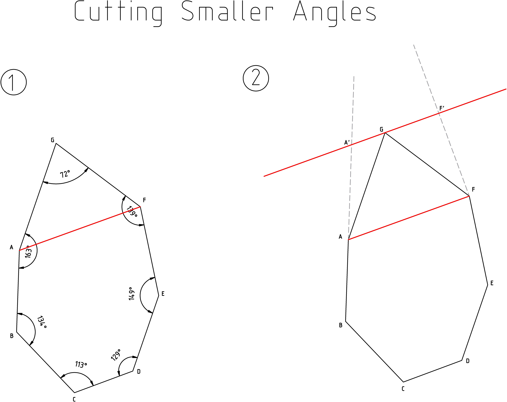
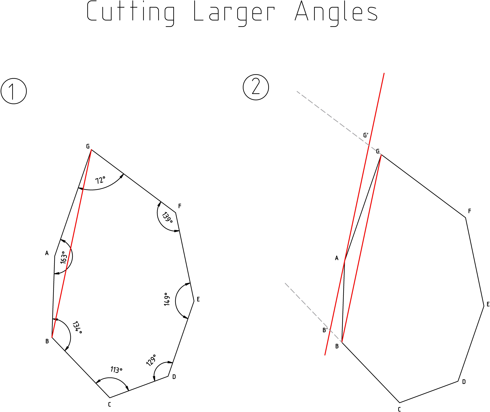

# Sperimentazione in Java

Questa repository contiene sperimentazioni per la ricerca del guscio convesso 
e delle sue approssimazioni utilizzando il linguaggio Java.

## Algoritmo di Ricerca del Guscio Convesso

Per la ricerca del guscio convesso dato un set di punti, è stato implementato l'algoritmo di ricerca noto 
come **Jarvis March** (o Gift Wrapping). Il guscio convesso trovato viene poi utilizzato per trovare diverse 
euristiche che consentiranno agli algoritmi di ricerca di trovare un poligono di n lati che possa approssimare con 
maggiore accuratezza possibile il guscio convesso.

## Algoritmi con euristica completa del guscio convesso
questi algoritmi presumono la completa conoscenza del guscio convesso,
procedono per semplificazione di questo tramite approssimazioni iterative.

#### 1. [Ipotesi di Algoritmo Cutting Smaller Angles (CSA)](src/main/java/heuristics/fromConvexHull/CuttingSmallerAngle.java)

Questo algoritmo prevede la classificazione e lo scarto dei vertici che creano gli angoli 
interni al poliedro che siano più acuti.

Si presume che gli angoli più acuti possano essere 
formati dai vertici che possono essere considerati outlier.

<strong>Approssimazione con 5 lati</strong>

    

        
        
10 punti

    

    

        
        
30 punti

    

    

        
        
50 punti

    

Le approssimazioni ottenute da questo algoritmo portano allo scarto di alcuni punti ammissibili poichè il poligono
risultante sarà sempre una approssimazione per difetto.

> **Indice di Jaccard**: ≈ 0.4

#### 2. [Ipotesi di Algoritmo Cutting Smaller Angles 2 (CSA2)](src/main/java/heuristics/fromConvexHull/CuttingSmallerAngle2.java)

Evolvendo la precedente ipotesi e consentendo all'algoritmo di poter includere i nodi esclusi traslando il taglio creato, 
si può cosi creare un guscio che oltre a essere convesso e rispettare l'inclusione necessaria di tutti i punti ammissibili.

        
        
1) Dimostrazione logica dell'algoritmo cutting Smaller Angles 
            2) Dimostrazione logica dell'algoritmo cutting Smaller Angles2

<strong>Approssimazione con 5 lati</strong>

    

        
        
10 punti

    

    

        
        
30 punti

    

    

        
        
50 punti

    

Questo approccio rende l'algoritmo precedente accettabile poichè include tutti i punti ammissibili,
tuttavia all'aumentare dei vertici è molto probabile che le traslazioni portino i lati del 
poliedro molto lontani dalla posizione ideale.

> **Indice di Jaccard**: ≈ 0.93

#### 3. [Ipotesi di Algoritmo Cutting Larger Angles (CLA)](src/main/java/heuristics/fromConvexHull/CuttingLargerAngle.java)

Applicando un cambio di ragionamento all'algoritmo CSA si potrebbe ipotizzare che gli angoli interni con ampiezza 
maggiore siano i candidati migliori per essere approssimati con un segmento, questo poichè la perdita di area 
applicando il taglio sarebbe minima.

<strong>Approssimazione con 5 lati</strong>

    

        
        
10 punti

    

    

        
        
30 punti

    

    

        
        
50 punti

    

Si rivela un approccio vincente e in termini di somiglianza con l'area del guscio convesso
condivide però assieme all'approcco CSA il fatto di non includere i nodi che vengono tagliati, 
rendendolo così inaccettabile.

> **Indice di Jaccard**: ≈ 0.91

#### 4. [Ipotesi di Algoritmo Cutting Larger Angles 2 (CLA2)](src/main/java/heuristics/fromConvexHull/CuttingLargerAngle2.java)

Applicando la medesima trasformazione fatta nell'algoritmo CSA2, si consente al precedente algoritmo di includere tutti 
i punti ammissibili, rendendo di fatto il precedente algoritmo accettabile.

        
        
1) Dimostrazione logica dell'algoritmo cutting Larger Angles 
            2) Dimostrazione logica dell'algoritmo cutting Larger Angles2

<strong>Approssimazione con 5 lati</strong>

    

        
        
10 punti

    

    

        
        
30 punti

    

    

        
        
50 punti

    

Il risultato ottenuto in termini di somiglianza visiva con il poligono originale è buono,
l'indice di Jaccard fornito risulta rispecchiare questo punto di vista,
può essere una opzione più che valida per l'approssimazione del guscio convesso.

> **Indice di Jaccard**: ≈ 0.93

## Algoritmi su Euristica Puntiforme

Questi algoritmi si basano su una euristica puntiforme che fornisce meno informazioni riguardo alla forma e alla 
disposizione dei punti nel piano. Gli algoritmi presentati utilizzano come euristica il punto che rappresenta il 
centro di massa del corretto guscio convesso.

#### 1. [Ipotesi di Algoritmo (Distance From G)](src/main/java/heuristics/DistanceFromG.java)

Questo algoritmo prevede la ricerca dei nodi più distanti dal baricentro del guscio convesso. Ad ogni iterazione 
viene aggiunto un nuovo vertice e vengono rimossi i vertici che, con l'aggiunta di quest'ultimo, vengono inclusi nel poliedro.

<strong>Approssimazione con 5 lati</strong>

    

        
        
10 punti

    

    

        
        
30 punti

    

    

        
        
50 punti

    

L'algoritmo risulta particolarmente efficace quando i punti sono distribuiti in maniera omogenea. Al contrario, 
quando i punti si concentrano lungo due poli o presentano una densità elevata attorno a un punto, 
l'approssimazione risulterà lontana dal reale convex hull.

> **Indice di Jaccard**: ≈ 0.9
