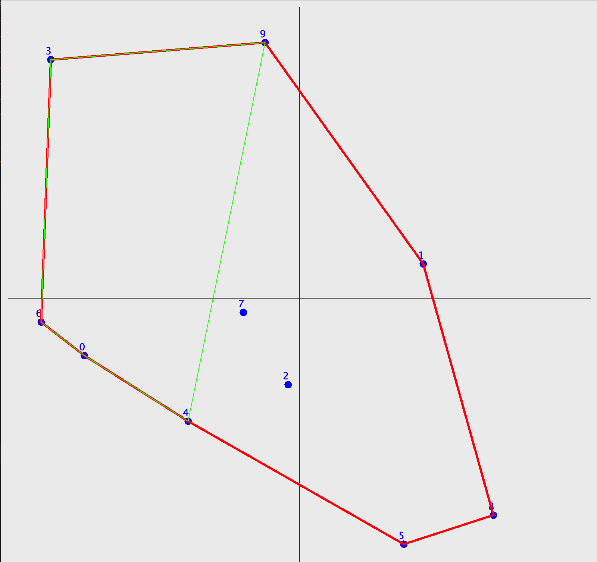
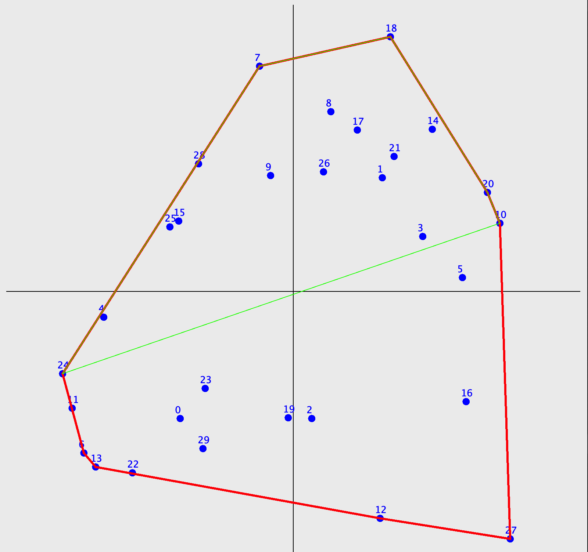
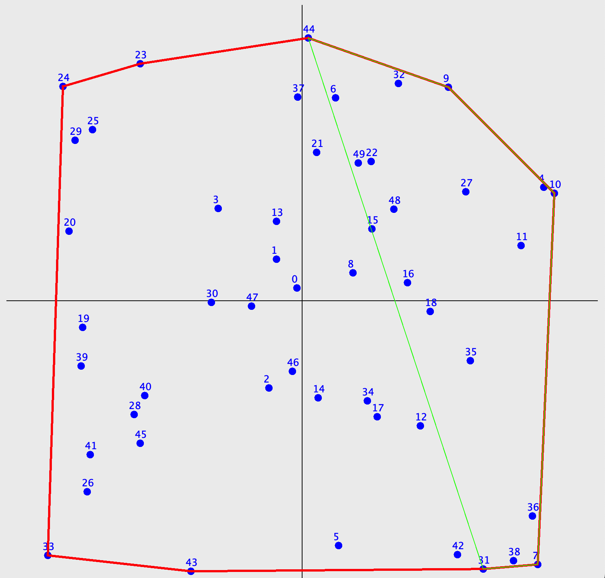

# Sperimentazione in JAVA

Questa repository contiene sperimentazioni per la ricerca del guscio convesso e delle sue approssimazioni utilizzando il linguaggio Java.

## Algoritmo di Ricerca del Convex Hull

Attualmente, è stato implementato l'algoritmo di ricerca del guscio convesso noto come **Jarvis March** o Gift Wrapping. 

## Ipotesi di Algoritmo (1)

Partendo dalla conoscenza di un guscio convesso, viene determinata un'euristica che fornisce il punto che determina il baricentro del guscio. L'algoritmo sfrutta il baricentro per ricavare successivamente gli n lati che costituiranno l'approssimazione.

## Ipotesi di Algoritmo (2)

Una seconda ipotesi per l'approssimazione del guscio convesso con un numero limitato di lati è 
implementata in [CuttingNodes](../../../tesi2/ConvexHull/src/heuristics/CuttingNodes.java). Questo algoritmo prevede la classificazione 
e lo scarto dei vertici che creano gli angoli interni più acuti nel poliedro.

    
    
    

## Ipotesi di Algoritmo (3)

Una terza ipotesi per l'approssimazione del guscio convesso con un numero limitato di lati è
una diretta evoluzione della precedente. il miglioramento prevede il prolungamento 
dei lati vicini al nodo rimosso, questo avviene tenendo conto del baricentro del triangolo creato
dallo stesso.
