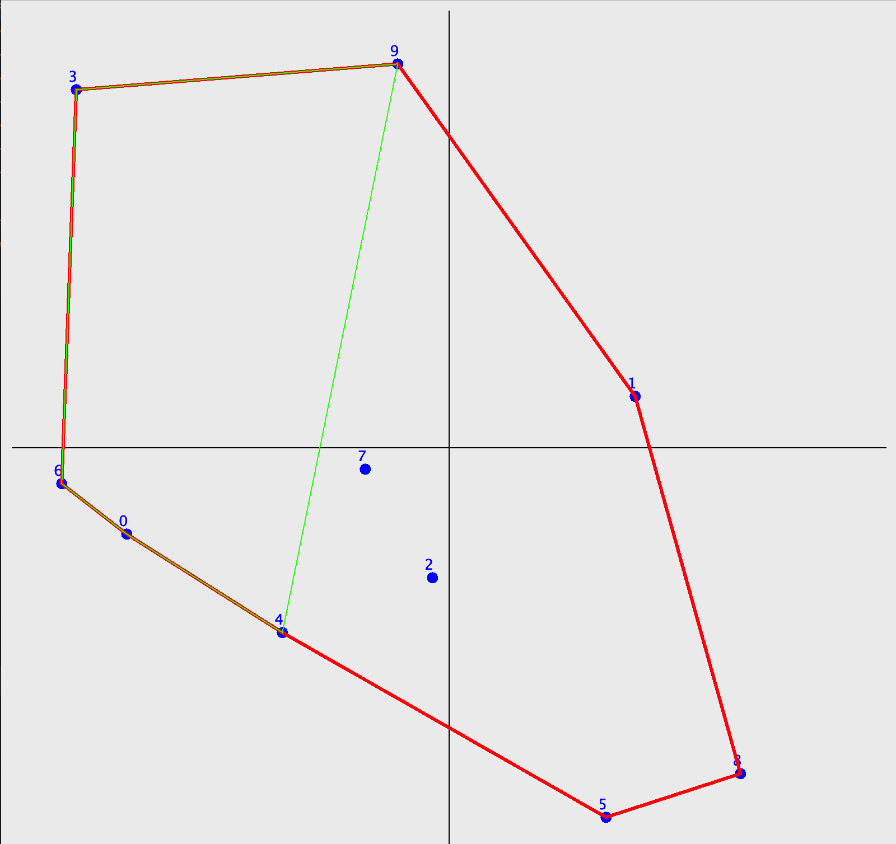
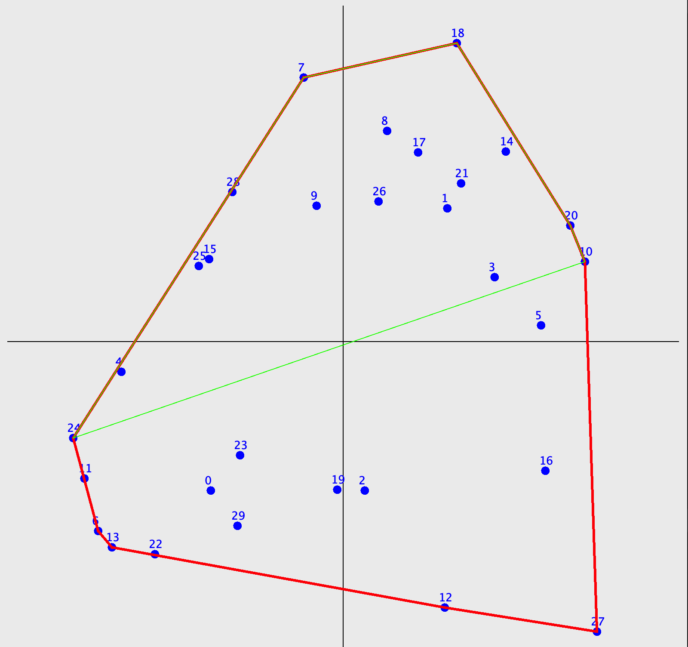
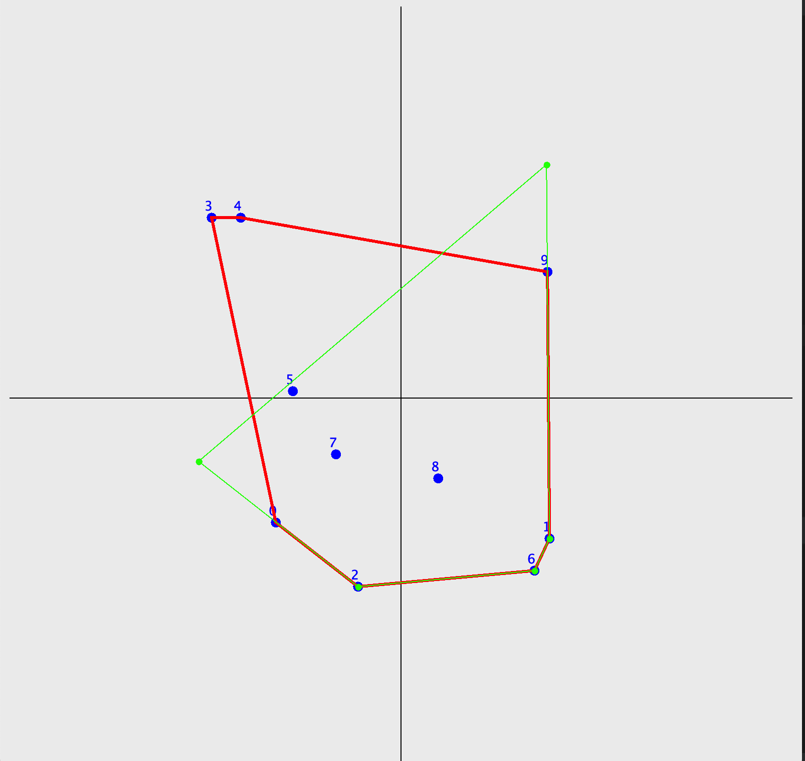
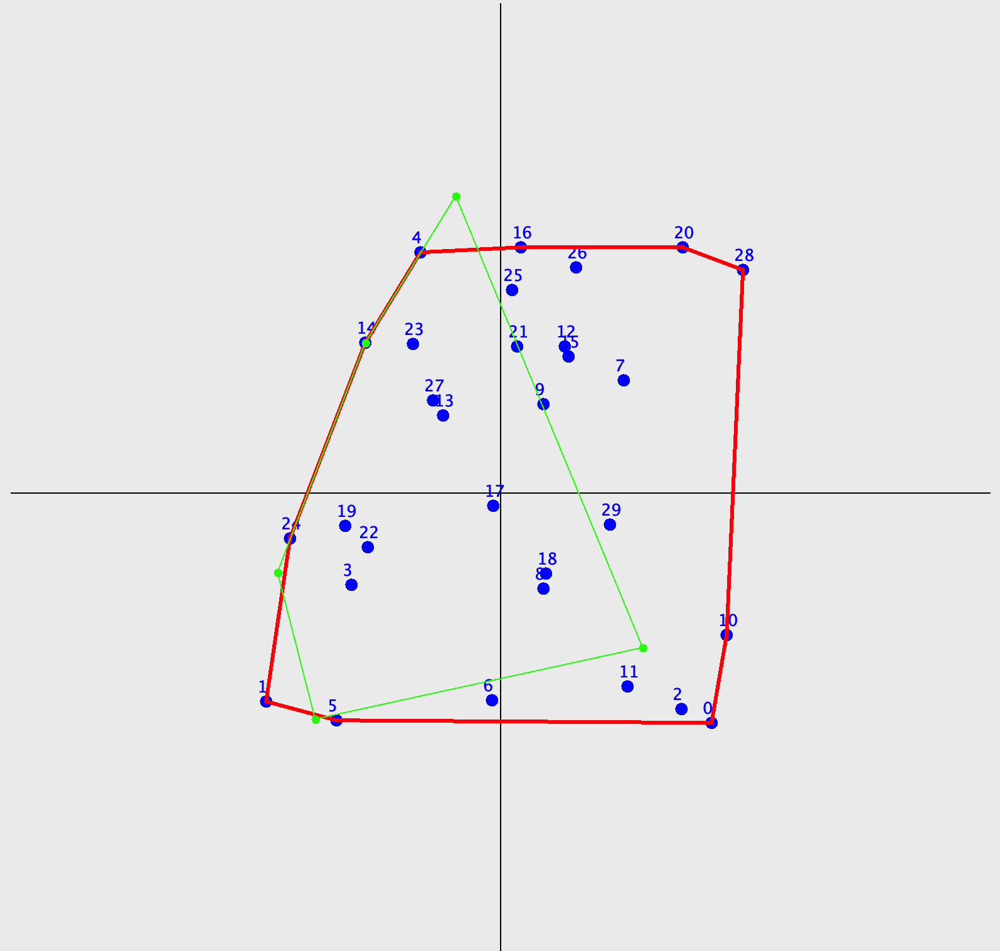
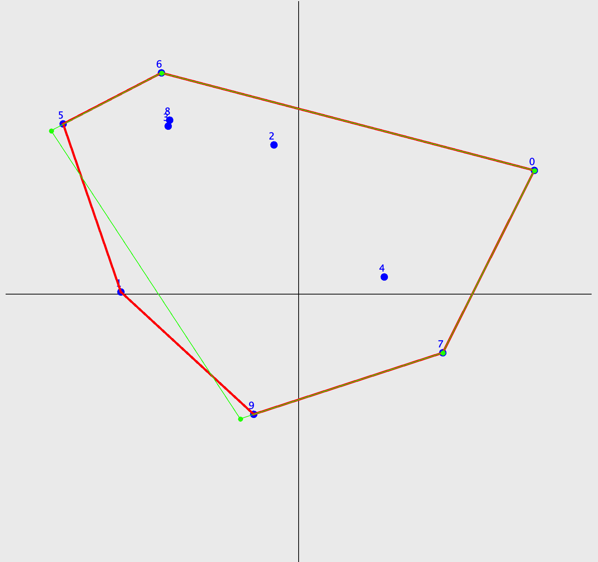
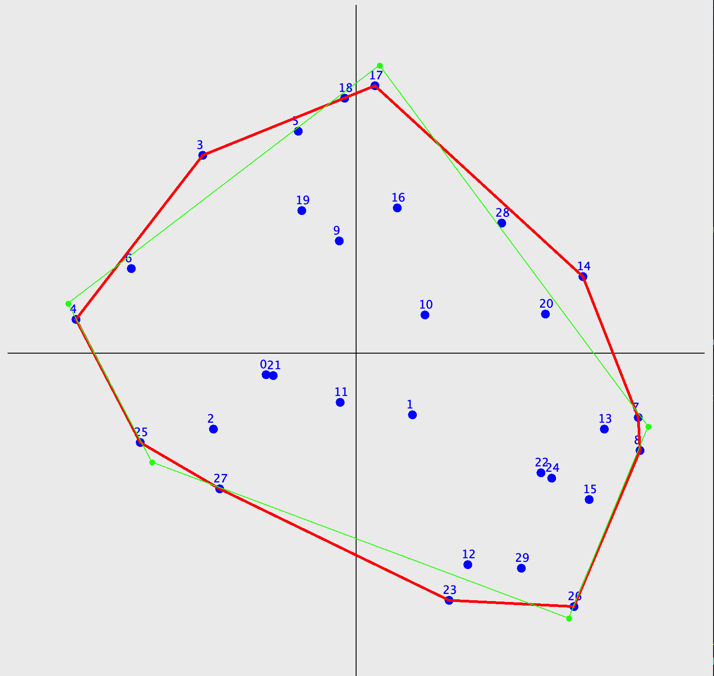
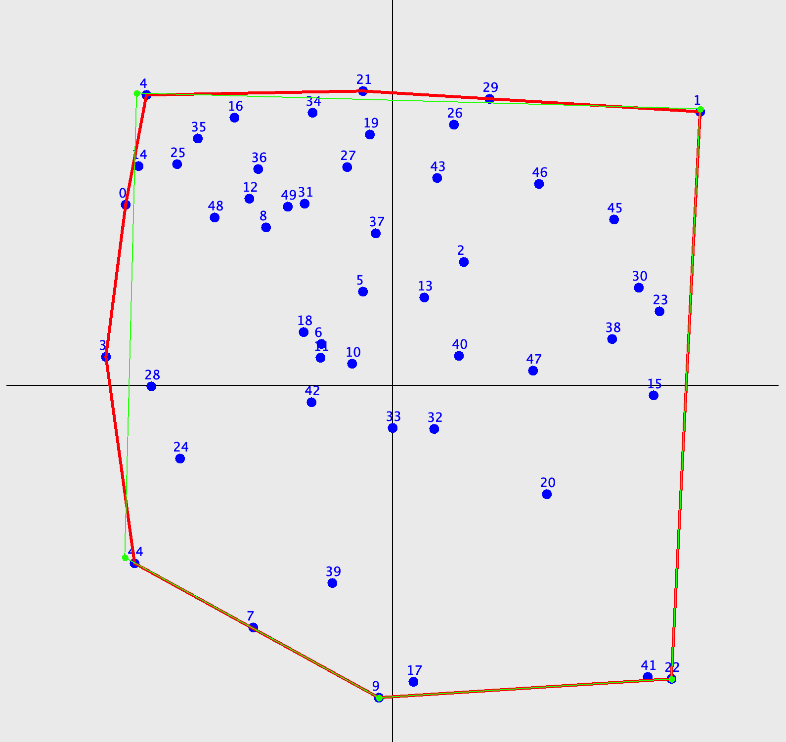

# Sperimentazione in JAVA

Questa repository contiene sperimentazioni per la ricerca del guscio convesso 
e delle sue approssimazioni utilizzando il linguaggio Java.

## Algoritmo di Ricerca del Convex Hull

Per la ricerca del guscio convesso dato un set di punti è stato implementato 
l'algoritmo di ricerca noto come **Jarvis March** o Gift Wrapping. 
Il guscio convesso trovato viene poi utilizzato per poter trovare differenti euristiche
che consentiranno agli algoritmi di ricerca di trovare un poligono 
di n lati che possa approssimare con piu' accuratezza possibile il guscio convesso

algoritmi che partono dalla conoscenza del guscio convesso

## 1) Ipotesi di Algoritmo (Cutting nodes)
Una ipotesi per l'approssimazione del guscio convesso con un numero limitato di lati è
implementata in [CuttingNodes](../../../tesi2/ConvexHull/src/heuristics/CuttingNodes.java). 
Questo algoritmo prevede la classificazione
e lo scarto dei vertici che creano gli angoli interni più acuti nel poliedro.

(questo poiche' si presume che gli angoli piu' acuti possano essere formati dai vertici che possano essere
considerati outlier)

    
    
    

questa strategia si rivela affidabile ma a partire dal guscio convesso si puo' solo ottenere
una approssimazione per difetto

> INDICE DI JACCARD ≈ 0.4

## 2) Ipotesi di Algoritmo (CuttingNodes2)

Una seconda ipotesi per l'approssimazione del guscio convesso con un numero limitato di lati è
una diretta evoluzione della precedente. Una volta preso in considerazione che il precedente algoritmo
produce un guscio convesso sicuramente minore dell'originale, si vuole dare a questo la possibilita'
di aumentare le dimensioni.
Il miglioramento prevede percio' il prolungamento dei lati vicini al nodo rimosso, 
questo avviene tenendo conto del baricentro del triangolo creato dallo stesso.

    
    
    

l'approccio utilizzato si rivela migliore del precedente ma non significativamente

> INDICE DI JACCARD ≈ 0.6

## 3) Ipotesi di Algoritmo (CuttingNodes3)

Un miglioramento del precedente algoritmo prevede di cambiare l'ipotesi secondo la quale gli spigoli
piu' esterni sarebbero quelli da considerare come outlier, al contrario si ipotizza che gli angoli interni 
con ampiezza maggiore siano i candidati migliori per poter essere approssimati con un segmento.

    
    
    

Questo nuovo approccio risulta di gran lunga migliore dei precedenti producendo un indice quasi pari alla perfezione
> INDICE DI JACCARD ≈ 0.95