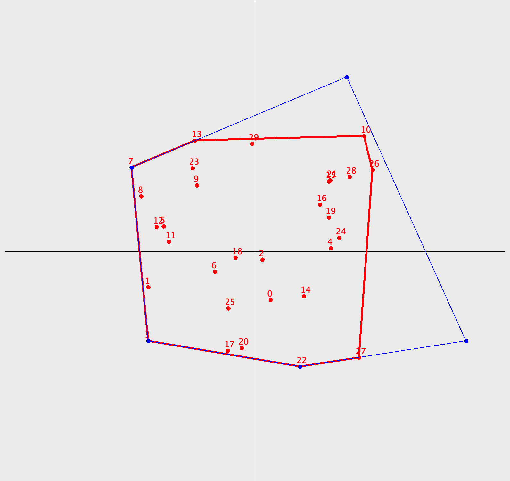

# Sperimentazione in Java

Questa repository contiene sperimentazioni per la ricerca del guscio convesso e delle sue approssimazioni utilizzando il linguaggio Java.

## Algoritmo di Ricerca del Guscio Convesso

Per la ricerca del guscio convesso dato un set di punti, è stato implementato l'algoritmo di ricerca noto come **Jarvis March** (o Gift Wrapping). Il guscio convesso trovato viene poi utilizzato per trovare diverse euristiche che consentiranno agli algoritmi di ricerca di trovare un poligono di n lati che possa approssimare con maggiore accuratezza possibile il guscio convesso.

## Algoritmi con euristica completa del guscio convesso
questi algoritmi presumono la completa conoscenza del guscio convesso,
procedono per semplificazione di questo tramite approssimazioni iterative.

#### 1. Ipotesi di Algoritmo Cutting Smaller Angles (CSA)

Una prima ipotesi per l'approssimazione del guscio convesso con un numero limitato di lati è implementata in [CuttingSmallerAngles](../../../tesi2/ConvexHull/src/heuristics/CuttingSmallerAngles.java). Questo algoritmo prevede la classificazione e lo scarto dei vertici che creano gli angoli interni al poliedro che siano più acuti. Si presume che gli angoli più acuti possano essere formati dai vertici che possono essere considerati outlier.

    
    
    

Questa strategia si rivela affidabile e facilmente prevedibile, ma a partire dal guscio convesso si può solo ottenere un'approssimazione per difetto.

> **Indice di Jaccard**: ≈ 0.4

#### 2. Ipotesi di Algoritmo Cutting Smaller Angles 2 (CSA2)

Evolvendo la precedente ipotesi e consentendo all'algoritmo di poter includere i nodi esclusi traslando il taglio creato, si può cosi creare un guscio che oltre a essere convesso e rispettare l'inclusione necessaria di tutti i punti ammissibili.

    
    
    

Questo approccio si rivela migliore del precedente, e il poliedro creato rispetta moldo di più la forma del guscio convesso ideale(dall'indice di Jaccard).

> **Indice di Jaccard**: ≈ 0.93

#### 3. Ipotesi di Algoritmo Cutting Larger Angles (CLA)

Applicando un cambio di ragionamento all'algoritmo CSA si potrebbe ipotizzare che gli angoli interni con ampiezza maggiore siano i candidati migliori per essere approssimati con un segmento, questo poichè la perdita di area applicando il taglio sarebbe minima.

    
    
    

Si rivela un approccio vincente e in termini di somiglianza con l'area del guscio convesso può essere paragonato al precedente CSA2, risulta però non includere come in CSA i nodi che vengono tagliati, rendendolo così inaccettabile.

> **Indice di Jaccard**: ≈ 0.91

#### 4. Ipotesi di Algoritmo Cutting Larger Angles 2 (CLA2)

Applicando la medesima trasformazione fatta nell'algoritmo CSA, si consente al precedente algoritmo di includere tutti i punti ammissibili, rendendo di fatto il precedente algoritmo accettabile.

    
    
    

Il risultato ottenuto in termini di somiglianza delle aree con il guscio convesso è del tutto simile a CSA2,
e dall'indice fornito risulta essere una opzione più che valida per l'approssimazione del guscio convesso.

> **Indice di Jaccard**: ≈ 0.93

## Algoritmi su Euristica Puntiforme

Questi algoritmi si basano su una euristica puntiforme che fornisce meno informazioni riguardo alla forma e alla disposizione dei punti nel piano. Gli algoritmi presentati utilizzano come euristica il punto che rappresenta il centro di massa del corretto guscio convesso.

#### 1. Ipotesi di Algoritmo (Distance From G)

Questo algoritmo prevede la ricerca dei nodi più distanti dal baricentro del guscio convesso. Ad ogni iterazione viene aggiunto un nuovo vertice e vengono rimossi i vertici che, con l'aggiunta di quest'ultimo, vengono inclusi nel poliedro.

    
    
    

L'algoritmo risulta particolarmente efficace quando i punti sono distribuiti in maniera omogenea. Al contrario, quando i punti si concentrano lungo due poli o presentano una densità elevata attorno a un punto, l'approssimazione risulterà lontana dal reale convex hull.

> **Indice di Jaccard**: ≈ 0.9
