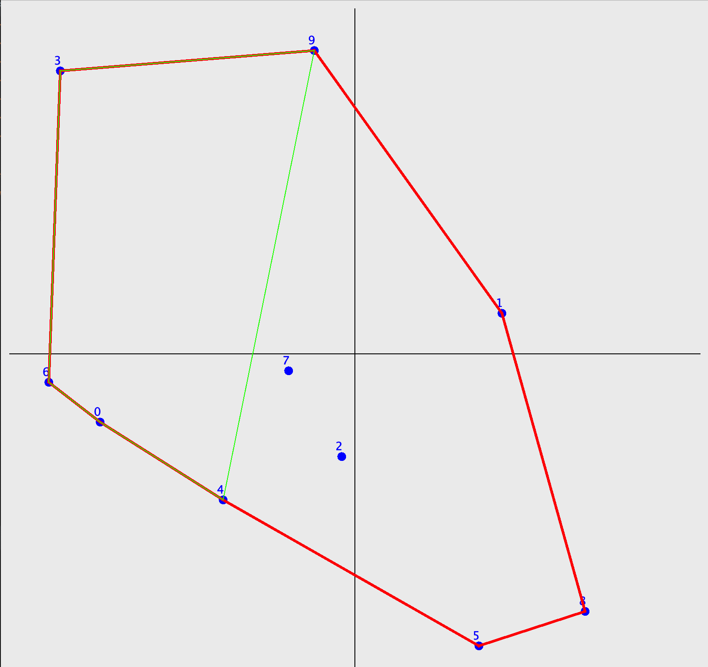
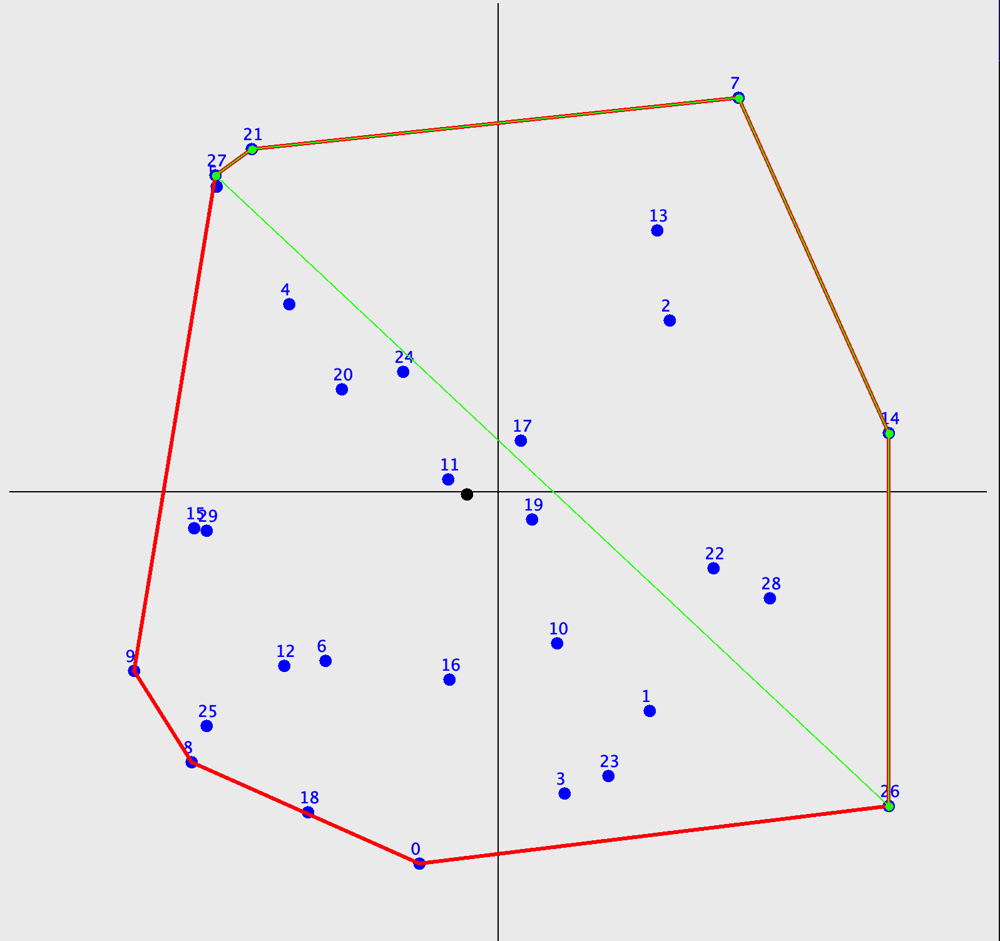
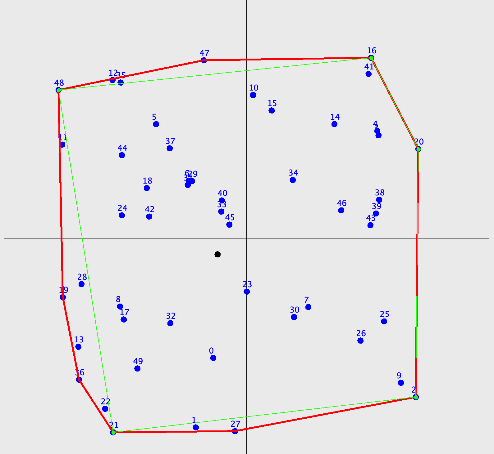

# Sperimentazione in Java

Questa repository contiene sperimentazioni per la ricerca del guscio convesso e delle sue approssimazioni utilizzando il linguaggio Java.

## Algoritmo di Ricerca del Guscio Convesso

Per la ricerca del guscio convesso dato un set di punti, è stato implementato l'algoritmo di ricerca noto come **Jarvis March** (o Gift Wrapping). Il guscio convesso trovato viene poi utilizzato per trovare diverse euristiche che consentiranno agli algoritmi di ricerca di trovare un poligono di n lati che possa approssimare con maggiore accuratezza possibile il guscio convesso.

### Algoritmi per l'Approssimazione del Guscio Convesso

#### 1. Ipotesi di Algoritmo (Cutting Nodes)

Una prima ipotesi per l'approssimazione del guscio convesso con un numero limitato di lati è implementata in [CuttingNodes](../../../tesi2/ConvexHull/src/heuristics/CuttingNodes.java). Questo algoritmo prevede la classificazione e lo scarto dei vertici che creano gli angoli interni più acuti nel poliedro. Si presume che gli angoli più acuti possano essere formati dai vertici che possono essere considerati outlier.

    
    
    

Questa strategia si rivela affidabile, ma a partire dal guscio convesso si può solo ottenere un'approssimazione per difetto.

> **Indice di Jaccard**: ≈ 0.4

#### 2. Ipotesi di Algoritmo (Cutting Nodes 2)

Una seconda ipotesi per l'approssimazione del guscio convesso con un numero limitato di lati è un'evoluzione della precedente. Si considera che il primo algoritmo produce un guscio convesso sicuramente minore dell'originale. Il miglioramento prevede quindi il prolungamento dei lati vicini al nodo rimosso, tenendo conto del baricentro del triangolo creato dallo stesso.

    
    
    

Questo approccio si rivela migliore del precedente, ma non significativamente.

> **Indice di Jaccard**: ≈ 0.6

#### 3. Ipotesi di Algoritmo (Cutting Nodes 3)

Un miglioramento del precedente algoritmo prevede di cambiare l'ipotesi secondo la quale gli spigoli più esterni sarebbero quelli da considerare come outlier. Al contrario, si ipotizza che gli angoli interni con ampiezza maggiore siano i candidati migliori per essere approssimati con un segmento.

    
    
    

Questo nuovo approccio risulta di gran lunga migliore dei precedenti, producendo un indice quasi pari alla perfezione.

> **Indice di Jaccard**: ≈ 0.95

## Algoritmi su Euristica Puntiforme

Questi algoritmi si basano su una euristica puntiforme che fornisce meno informazioni riguardo alla forma e alla disposizione dei punti nel piano. Gli algoritmi presentati utilizzano come euristica il punto che rappresenta il centro di massa del corretto guscio convesso.

#### 1. Ipotesi di Algoritmo (Distance From G)

Questo algoritmo prevede la ricerca dei nodi più distanti dal baricentro del guscio convesso. Ad ogni iterazione viene aggiunto un nuovo vertice e vengono rimossi i vertici che, con l'aggiunta di quest'ultimo, vengono inclusi nel poliedro.

    
    
    

L'algoritmo risulta particolarmente efficace quando i punti sono distribuiti in maniera omogenea. Al contrario, quando i punti si concentrano lungo due poli o presentano una densità elevata attorno a un punto, l'approssimazione risulterà lontana dal reale convex hull.

> **Indice di Jaccard**: ≈ 0.9
